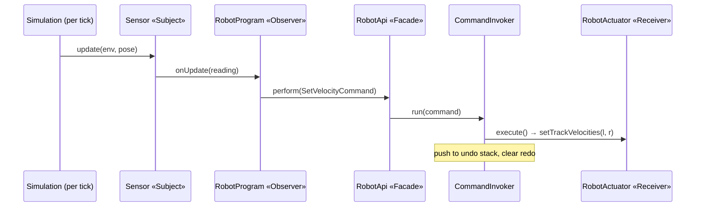

# UML & Design Rationale — HW3 Skid-Steer Robot Simulation

This document models the provided starter **and** the pieces I add, and records the design
decisions behind the additions. Diagrams are Mermaid (they render on GitHub).

**Notation**

- Visibility: `+` public, `#` protected, `-` private. All stored attributes are private.
- Status tags used in the prose: **[P]** provided & working · **[P\*]** provided, I fill the
  method body · **[S]** I author the class.

---

## Diagram 1 — Master class diagram (Observer + Command)

One diagram for both structural patterns, because they share their key types (`Observer`, `Sensor`,
`RobotSensors`, `RobotApi`, and the programs). Read it in three bands:

- **Observer** (top) — each `Sensor` is a `Subject`; `TelemetryPanel` and the programs are the
  observers. `Robot` implements `RobotSensors`, so its sensors *are* the subjects.
- **Command** (middle) — `SetVelocityCommand` / `CompositeCommand` run through `CommandInvoker`
  behind the `RobotApi` facade; `Robot` is the `RobotActuator` receiver.
- **Programs** (bottom) — the seam: each `RobotProgram` *observes* sensors (holds `Observer` fields)
  and *acts* by performing commands through `RobotApi`.

```mermaid
classDiagram
direction TB
%% ---- Observer pattern (sensors are Subjects) ----
class Observer~T~ {
  <<interface>>
  +onUpdate(value: T)
}
class Subject~T~ {
  <<interface>>
  +subscribe(o: Observer~T~)
  +unsubscribe(o: Observer~T~)
  +notifyObservers(value: T)
}
class AbstractSubject~T~ {
  <<abstract>>
  -observers
  +subscribe(o: Observer~T~)
  +unsubscribe(o: Observer~T~)
  +notifyObservers(value: T)
}
class Sensor~T~ {
  <<abstract>>
  +label: String
  -reading: T
  +update(env, pose)
  #measure(env, pose) T
}
class SonarSensor {
  #measure() Double
}
class VisionSensor {
  #measure() Color
}
class TemperatureSensor {
  #measure() Double
}
class LineSensor {
  #measure() Boolean
}
class CollisionSensor {
  #measure() Boolean
}
class RobotSensors {
  <<interface>>
  +sonar: Sensor~Double~
  +vision: Sensor~Color~
  +temperature: Sensor~Double~
  +lineLeft: Sensor~Boolean~
  +lineCenter: Sensor~Boolean~
  +lineRight: Sensor~Boolean~
  +collision: Sensor~Boolean~
}
class TelemetryPanel {
  -sonarObs: LabelObserver~Double~
  -temperatureObs: LabelObserver~Double~
  -visionObs: LabelObserver~Color~
  -collisionObs: LabelObserver~Boolean~
  -lineLeftObs: Observer~Boolean~
  -lineCenterObs: Observer~Boolean~
  -lineRightObs: Observer~Boolean~
  -bound: Robot
  +bindTo(robot: Robot)
  +unbind()
}
class LabelObserver~T~ {
  -label: Label
  -format: (T) String
  +onUpdate(value: T)
}
AbstractSubject ..|> Subject
Sensor --|> AbstractSubject
SonarSensor --|> Sensor
VisionSensor --|> Sensor
TemperatureSensor --|> Sensor
LineSensor --|> Sensor
CollisionSensor --|> Sensor
RobotSensors ..> Sensor : exposes
LabelObserver ..|> Observer
TelemetryPanel ..> RobotSensors : subscribes/unsubscribes
TelemetryPanel o-- LabelObserver : holds
TelemetryPanel o-- Observer : holds

%% ---- Command pattern + application interface ----
class Command {
  <<interface>>
  +execute()
  +undo()
}
class RobotActuator {
  <<interface>>
  +leftTrackVelocity: Double
  +rightTrackVelocity: Double
  +setTrackVelocities(left, right)
}
class SetVelocityCommand {
  -actuator: RobotActuator
  -left: Double
  -right: Double
  -prevLeft: Double
  -prevRight: Double
  +execute()
  +undo()
}
class CompositeCommand {
  -commands: List~Command~
  +execute()
  +undo()
}
class CommandInvoker {
  -undoStack: ArrayDeque~Command~
  -redoStack: ArrayDeque~Command~
  +run(command: Command)
  +undo()
  +redo()
  +canUndo() Boolean
  +canRedo() Boolean
}
class Robot {
  -pose: Pose
  +setTrackVelocities(left, right)
  +step(dt, env)
}
class RobotApi {
  <<interface>>
  +sensors: RobotSensors
  +actuator: RobotActuator
  +perform(command: Command)
  +perform(commands: List~Command~)
  +undo()
  +redo()
}
class DefaultRobotApi {
  -invoker: CommandInvoker
  +perform(command: Command)
  +perform(commands: List~Command~)
  +undo()
  +redo()
}
%% ---- Programs: the Observer/Command seam ----
class RobotProgram {
  <<interface>>
  +name: String
  +startProgram(robot: RobotApi)
  +stopProgram(robot: RobotApi)
}
class LineFollowerProgram {
  -leftObs: Observer~Boolean~
  -centerObs: Observer~Boolean~
  -rightObs: Observer~Boolean~
  -api: RobotApi
  +startProgram(robot: RobotApi)
  +stopProgram(robot: RobotApi)
}
class HeatSeekerProgram {
  -tempObs: Observer~Double~
  -sonarObs: Observer~Double~
  -api: RobotApi
  +startProgram(robot: RobotApi)
  +stopProgram(robot: RobotApi)
}
class BallFinderProgram {
  -visionObs: Observer~Color~
  -sonarObs: Observer~Double~
  -collisionObs: Observer~Boolean~
  -api: RobotApi
  +startProgram(robot: RobotApi)
  +stopProgram(robot: RobotApi)
}
class ProgramRegistry {
  <<interface>>
  +register(program: RobotProgram)
  +programs() List~RobotProgram~
}
class DefaultProgramRegistry {
  +register(program: RobotProgram)
  +programs() List~RobotProgram~
}
class StudentPrograms {
  +registerAll(registry: ProgramRegistry)
}
class ProgramRunner {
  +run(program: RobotProgram)
  +stop()
}
SetVelocityCommand ..|> Command
CompositeCommand ..|> Command
CompositeCommand o-- Command
SetVelocityCommand --> RobotActuator
CommandInvoker o-- Command : history
Robot ..|> RobotActuator
DefaultRobotApi ..|> RobotApi
DefaultRobotApi --> CommandInvoker
RobotApi ..> RobotActuator
LineFollowerProgram ..|> RobotProgram
HeatSeekerProgram ..|> RobotProgram
BallFinderProgram ..|> RobotProgram
LineFollowerProgram ..> RobotApi : performs
LineFollowerProgram ..> Command : builds
HeatSeekerProgram ..> RobotApi : performs
HeatSeekerProgram ..> Command : builds
BallFinderProgram ..> RobotApi : performs
BallFinderProgram ..> Command : builds
DefaultProgramRegistry ..|> ProgramRegistry
StudentPrograms ..> ProgramRegistry
StudentPrograms ..> RobotProgram : creates
ProgramRunner --> RobotProgram
ProgramRunner --> RobotApi
%% ---- cross-pattern links (why one diagram) ----
Robot ..|> RobotSensors
RobotApi ..> RobotSensors : exposes
LineFollowerProgram ..> RobotSensors : observes
HeatSeekerProgram ..> RobotSensors : observes
BallFinderProgram ..> RobotSensors : observes
```

**Legend.** **[P]** provided & working · **[P\*]** provided, I fill the method body · **[S]** I author it.

- **[P\*]** `AbstractSubject` (three bodies), `CommandInvoker` (`run`/`undo`/`redo`),
  `StudentPrograms.registerAll`, and the bodies of `TelemetryPanel.bindTo` / `unbind`.
- **[S]** `LabelObserver`, `SetVelocityCommand`, `CompositeCommand`, and the three programs.
- **[P]** everything else — `Observer`, `Subject`, `Sensor` + subclasses, `RobotSensors`, `Command`,
  `RobotActuator`, `Robot` (implements both `RobotActuator` **and** `RobotSensors`), `RobotApi`,
  `DefaultRobotApi`, `RobotProgram`, `ProgramRegistry`, `DefaultProgramRegistry`, `ProgramRunner`.

---

## Diagram 2 — The integration seam (where Observer meets Command)

This is the closed loop the assignment cares about: a sensor notification (Observer) becomes a
`perform` call (Command), on every tick.

---

## Constraints I do *not* get to decide (fixed by the starter)

These shape every decision below, so they are listed once here rather than re-argued each time.

- `Observer<T>` / `Subject<T>` are **generic per reading type** — `Sensor<Double>`,
  `Sensor<Color>`, `Sensor<Boolean>`. One object cannot implement two different `Observer<T>`.
- Sensors call `notifyObservers` **every tick**, not only on change — a subscription is a clock.
- The command **receiver is `RobotActuator`** (two track velocities), not the whole `Robot`.
- `CommandInvoker` already owns two `ArrayDeque<Command>`; I implement the three method bodies.
- `RobotApi` is a **provided Facade** over the invoker; manual UI and programs are both its clients.

---

## Design decisions

Each decision lists the options with pros/cons and marks the recommendation with ✅.

### D1 — Shape of the command set

| Option | Pros | Cons |
|---|---|---|
| ✅ **Single `SetVelocityCommand(actuator, left, right)`** (+ Composite, see D2) | Matches the starter's own hint; all five buttons and any program velocity flow through one class; snapshot/undo logic written once; least duplication | On its own reads as one class, not a "set" (D2 fixes this); action intent (turn vs. forward) is not encoded in the type |
| Abstract `RobotCommand` base + named subclasses (`Forward`, `Back`, `TurnLeft`, `TurnRight`, `Stop`) | Named intent per action; a clear "set of classes"; base centralizes undo via **Template Method** (an extra pattern for Req 3.4) | Five classes differing only by constants; the base pays off only with several subclasses; fixed speeds are less flexible for programs needing arbitrary velocities |
| Single class, no base, no composite | Absolute minimum code | Singular "class" vs. the required "set"; forgoes easy Composite credit |

**Recommendation:** `SetVelocityCommand` as the workhorse; "Stop" is just `SetVelocityCommand(actuator, 0.0, 0.0)`. Choose the abstract-base route only if you specifically want named action types.

### D2 — Include `CompositeCommand`?

| Option | Pros | Cons |
|---|---|---|
| ✅ **Include it** | Makes "a set of well-designed Command classes" true *without* duplicate classes; is a real pattern (**Composite**) for Req 3.4; pairs with the provided `perform(List<Command>)`; lets a program treat "turn then advance" as one undoable unit; explicitly listed under the assignment's extensions | A little more code; `undo()` must reverse the child order (easy to get wrong, so test it) |
| Omit it | Less code | Leans on the D1 subclass route for plurality; skips a clean, cheap pattern |

### D3 — Where the undo state lives

| Option | Pros | Cons |
|---|---|---|
| ✅ **In the command** — each captures `prevLeft`/`prevRight` in `execute()` | Keeps `CommandInvoker` trivial and testable with a fake `Command` (no robot needed); command is self-contained; matches the assignment's wording | Each command carries a little state |
| In the invoker — snapshot robot state around each `run` | Commands become stateless | Couples the invoker to the receiver's shape; breaks the moment a command changes more than velocity; harder to unit-test |

### D4 — Telemetry: named observer vs. inline lambdas

| Option | Pros | Cons |
|---|---|---|
| ✅ **`LabelObserver<T>`** class | Reusable across all six labels; gives graders a clear *second* concrete Observer beyond the program; models cleanly in UML | One extra small class; needs a formatter (a `Color` reads differently than a `Double`) |
| Inline `subscribe { v -> label.text = ... }` lambdas in `bindTo` | Least code; idiomatic for a Kotlin `fun interface` | No named Observer type in the diagram; formatting logic scattered across `bindTo`; **an anonymous subscription cannot be unsubscribed** |

Every telemetry observer is stored as a field — the four single-value labels use `LabelObserver`, and
the three line sensors (which share one L/C/R label) use named `Observer<Boolean>` fields rather than
inline lambdas. Storing all of them is what lets `unbind`/`bindTo` remove them again (see D5).

### D5 — How a program observes (has-a vs. is-a)

| Option | Pros | Cons |
|---|---|---|
| ✅ **Program *has* observers** — stores each as a field, subscribes in `startProgram`, unsubscribes in `stopProgram` | Works with the generic per-type sensors; composition over inheritance; clean teardown; caches readings from multiple sensors | Must retain each observer reference to unsubscribe; the program coordinates several callbacks |
| Program *is* an Observer — implements `Observer<T>` directly | One fewer object when a single sensor is used | Impossible when subscribing to sensors of different `T` (type erasure) — e.g. the ball finder needs `Color` **and** `Double`; not viable in general |

> Correctness note carried by this decision: **both the telemetry panel and the programs store every
> observer as a field and unsubscribe it.** A **program must `unsubscribe`** in `stopProgram`, because
> it stops while the same robot lives on — otherwise it leaks observers and keeps driving. The
> **telemetry panel** is re-bound to a fresh `Robot` on every reset/environment change; even though the
> old subject is discarded, `bindTo` first calls `unbind()` to detach from the previous robot (and
> `unbind()` is available for disposal), so subscriptions never accumulate. This requires that the
> panel keep named references to *all* its observers — including the three line-sensor observers — so
> nothing is left as an un-removable anonymous subscription.

### D6 — One program per environment

| Option | Pros | Cons |
|---|---|---|
| ✅ **Three programs** (`LineFollowerProgram`, `HeatSeekerProgram`, `BallFinderProgram`), each registered | Each is an interchangeable **Strategy** selected from the dropdown (Req 3.4); self-contained; one per objective; small enough to test | Three classes to write and verify |
| One program that branches on the environment | Fewer classes | Violates SRP/OCP; not Strategy; a growing `if/when` that is hard to reason about |

### D7 — Depend on interfaces, not concretes (DIP)

Programs reference only `RobotApi`, `Command`, and `Observer` — never `Robot` or `DefaultRobotApi`.
This is Req 3.4 made structural, and it is why the diagram shows a program's only outward edges
going to interfaces. Pro: swappable, testable, honors the facade. Con: none worth noting here.

---

## Patterns present (for Req 3.4)

| Pattern | Where | Provided or mine |
|---|---|---|
| Observer | `Subject`/`Observer`/`AbstractSubject`; sensors → telemetry & programs | pattern mine to implement |
| Command | `Command`, `SetVelocityCommand`, `CommandInvoker` | mine |
| Composite | `CompositeCommand` | mine |
| Strategy | interchangeable `RobotProgram`s in the dropdown | mine |
| Template Method | only if D1's abstract-base route is chosen | mine (optional) |
| Facade | `RobotApi` / `DefaultRobotApi` over the invoker | provided |
| Registry / Simple Factory | `ProgramRegistry` + `StudentPrograms.registerAll` | provided hook, I register |
